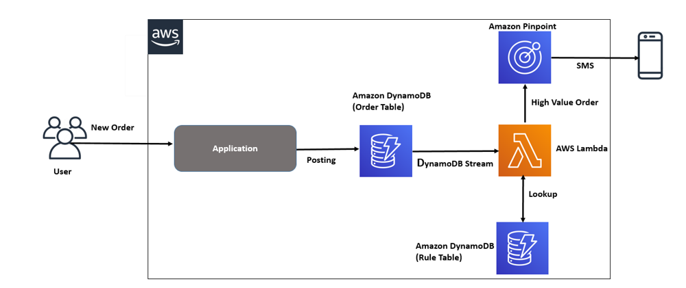
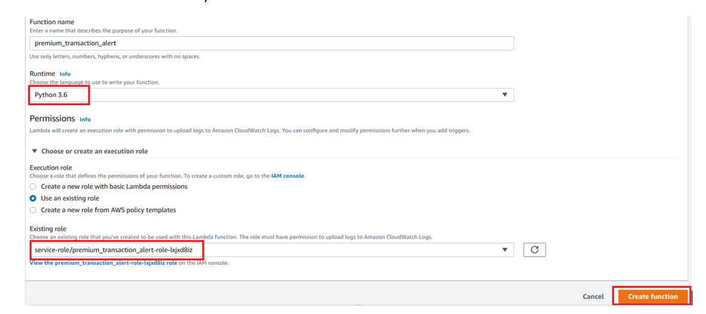
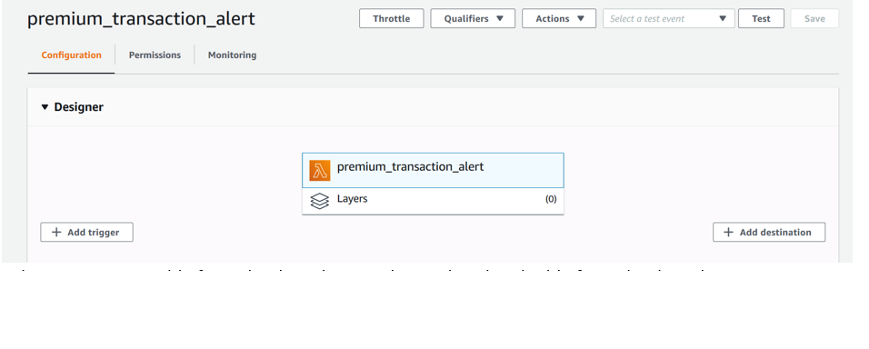
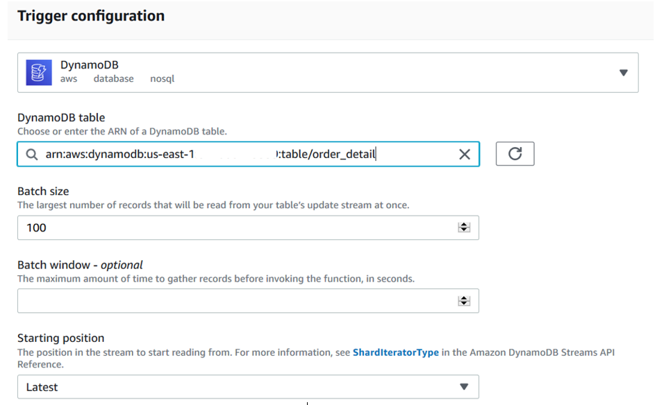
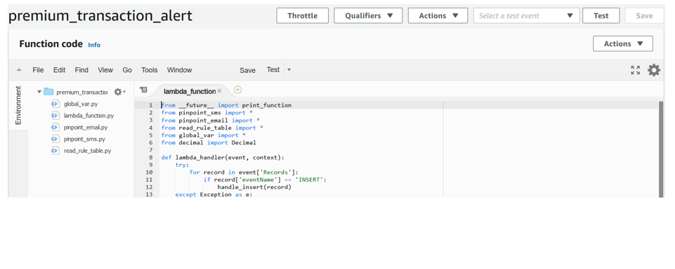

## Send real time alert notification using Amazon Pinpoint

Companies use real time notifications in many situation which includes anamolies detection, healthcare emergency, critical operation failure, real time crime and emergency info, fraud transaction to take decision/action as when it happens. Email is a traditional way of sending message notification. But, these use case  demands real time notification. To overcome enterprise communication challenges, SMS and Push notification is used to notify stakeholders in real time. However, building a large-scale real time notification solution can be a complex and costly challenge for a business. You need build your infrastructure, set up your network and then warm up your IP addresses and continually protect your sender reputation. Many third-party email solutions come with contracts  and up-front costs.
Amazon Pinpoint service allows you to engage with your satkeholders by sending email, SMS and push notification messages. Your App  can use the Amazon Pinpoint API and the AWS SDKs to send transactional messages directly. With transactional messages, you send to specific recipients, as opposed to messages that you send to segments. There is no minimum fee, no setup cost and no fixed monthly cost to Amazon Pinpoint. You only pay for the messages you send, so you can start small and scale as your application grows. Amazon Pinpoint can be integrated seamlessly with other AWS services
I am taking a use case where a business heads wants to get a notification if a customer makes a very large value order transaction. This requires immediate attention as business head wants to ensure that there is enough inventory available to deliver goods to this premium customer on time and no slippage in committed delivery date. This also requires to have fast coordination among different business units including inventory, purchasing, production, shipment, finance to ensure a proper attention to this order. 

## Architecture

## Set up Amazon Lambda
In this step, we will create Amazon Lambda function, integrate with order_detail table, check the order value if it is large value order transaction and send a notification.
1. Navigate to Service>Lambda
2. Click on Create function	
3. Select runtime as python 3.6. Select an execution role. Please make sure your role gives read access to Amazon DynamoDB table. It should be like this:

4. Click on Add Trigger.

5. Select DynamoDB table from the drop down. Select order_detail table from the drop down. Keep everything default. This integrates order_detail streaming to our Amazon lambda function. Our Lmabda function will be invoked everythime a transaction happens in order_detail table. 

6. Now copy  the source code. It should be like this:

a. global_var.py
This module contains all global variables . 
* applicationId : The Amazon Pinpoint project/application ID to use when you send this message. Make sure that the SMS channel is enabled for the project or application that you choose.

* messageType : # The type of SMS message that you want to send. If you plan to send time-sensitive content, specify TRANSACTIONAL. If you plan to send marketing-related content, specify PROMOTIONAL.

* senderId : A sender ID is an alphabetic name that identifies the sender of an SMS message. When you send an SMS message using a sender ID, and the recipient is in an area where sender ID authentication is supported, your sender ID appears on the recipient’s device instead of a phone number. A sender ID provides SMS recipients with more information about the sender than a phone number or short code provides.

* registeredKeyword :The registered keyword associated with the originating short code.

* region : # The AWS Region that you want to use to send the message. For a list of AWS Regions where the Amazon Pinpoint API is available, see https://docs.aws.amazon.com/pinpoint/latest/apireference/

* originationNumber :The phone number or short code to send the message from. The phone number or short code that you specify has to be associated with your Amazon Pinpointaccount. For best results, specify long codes in E.164 format.

* sender : The "From" address. This address has to be verified in Amazon Pinpoint in the region you're using to send email.

* Charset : The character encoding that you want to use for the subject line and message body of the email.  

b. lambda_function.py
c. pinpoint_email.py 
This module is used to send email to the specified reciepent 
d. pinpoint_sms.py
This module is used to send SMS to the specified mobile
e. read_rule.py
This module reads the transaction_alert_rule table to  high value transaction threshold

See [CONTRIBUTING](CONTRIBUTING.md#security-issue-notifications) for more information.

## License

This library is licensed under the MIT-0 License. See the LICENSE file.

